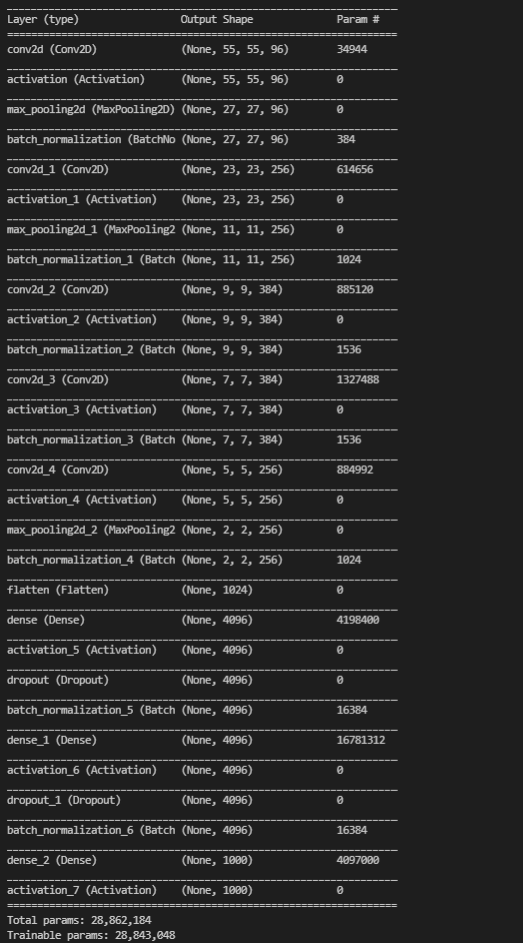

# AlexNet

## The Dataset

The dataset is a subset of the main ImageNet dataset that included 1.2M high-resolution images in 1000 categories. The main ImageNet dataset contains more than 15M high-res images in about 22000 categories.

## Key Takeaways

* ReLu activation was used since Tanh is known to be saturating in long time which cause in a longer training time and late convergence of gradients.

* Local Response Normalisation was used. This is based on the biological concept called Lateral Inhibition that states that a neuron's state of excitement is inhited by it's neighbouring neurons

* Dropout was also introduced to battle overfitting.

## Model Architecture

