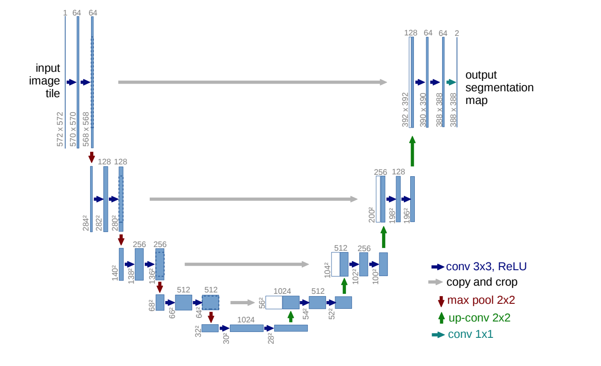

# U-NET
The U-NET was introduced for mainly semantic segmentation which is classification + localization i.e you have to label every pixel to what class it belongs to . This is also called 
Dense Prediction since we are predicting for every pixel in the image. So unlike normal classification that returns a single class value as output, we need the whole image back.

## The Architecture
It mainly consists of two parts - the contraction path and the expanding path.

### Contraction Path
This part captures the context in the image. It is more like a stack with just conv layers(+relu) and max pooling.

### Expanding Path
This part deals with the localization using *transposed* convolutions. The transposed convolutions will help in the upsampling of the images.

